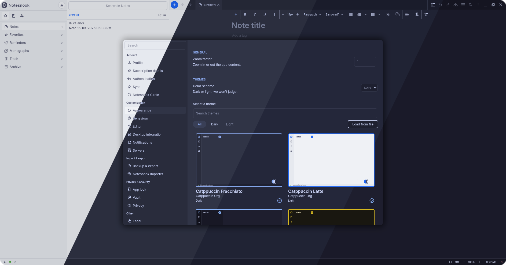
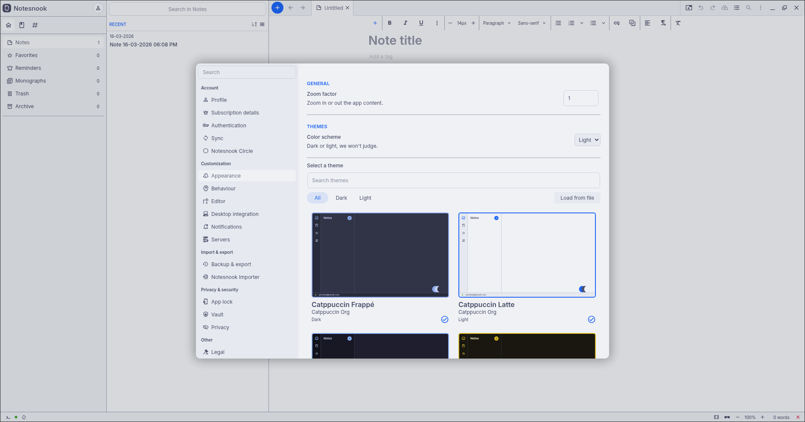
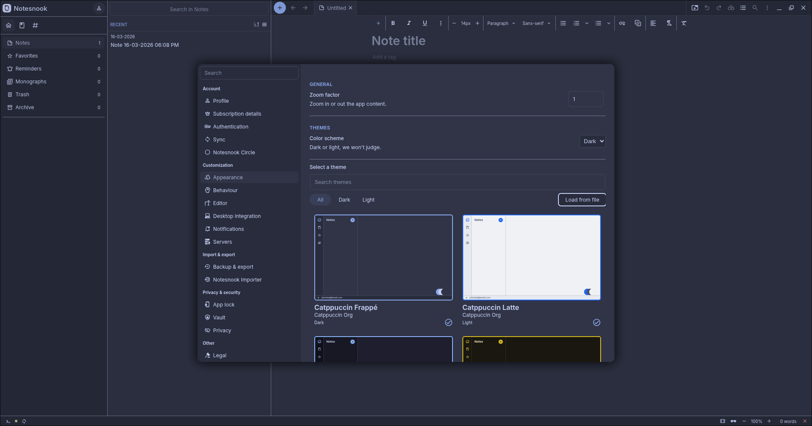
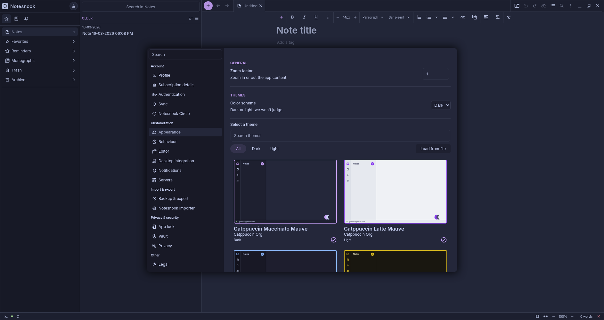
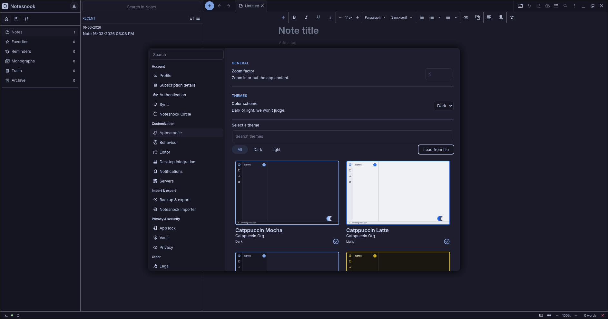

<h3 align="center">
	 
	
	Catppuccin for <a href="https://notesnook.com">Notesnook</a>
	
</h3>

	
	
	

	

## Previews

🌻 Latte

🪴 Frappé

🌺 Macchiato

🌿 Mocha

## Usage

1. Download the flavor and accent combination of your choice from [themes](themes).
2. Open the app and click the profile icon in the top left corner.
3. In the dropdown menu, select **Settings** and then **Appearance**.
4. Click **Load from file** and choose the downloaded file.
5. Enjoy!

### Switching between Light and Dark
If you want to switch between Latte and one of the dark flavors, you can download the file of the other flavor and load it. After that, you can use the built-in color scheme switcher to switch between the two.

### Switching between Two Dark Flavors
If you want to switch between two dark flavors, you can change the color scheme of one of the flavors before importing it to the opposite of the other flavor to allow switching between two dark themes.

## 💝 Thanks to

- [Scarce Koi](https://github.com/scarckoi)

&nbsp;

	

	Copyright &copy; 2021-present <a href="https://github.com/catppuccin" target="_blank">Catppuccin Org</a>

	

